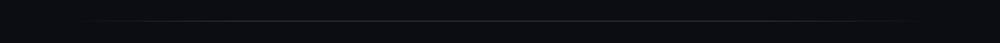
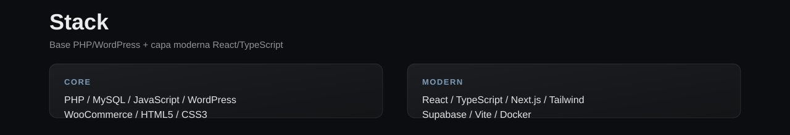
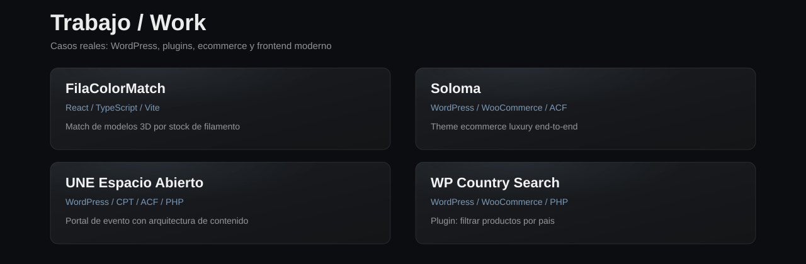

<!-- Profile README · visual system aligned with portfolio2026_test1 -->
<!-- GitHub can't run site CSS — identity is carried by SVG assets -->

  

  
  &nbsp;
  
  &nbsp;
  

  

  

  

  

  <a href="https://filacolormatch.vercel.app/">FilaColorMatch</a>
  ·
  <a href="https://soloma.co/">Soloma</a>
  ·
  <a href="https://uneespacioabierto.com.ar/">UNE</a>
  ·
  <a href="https://github.com/horaciodominguez/wp-country-search">WP Country Search</a>
  ·
  <a href="https://horaciodominguez.com">Más en el portfolio →</a>

  

  

 

  
  

