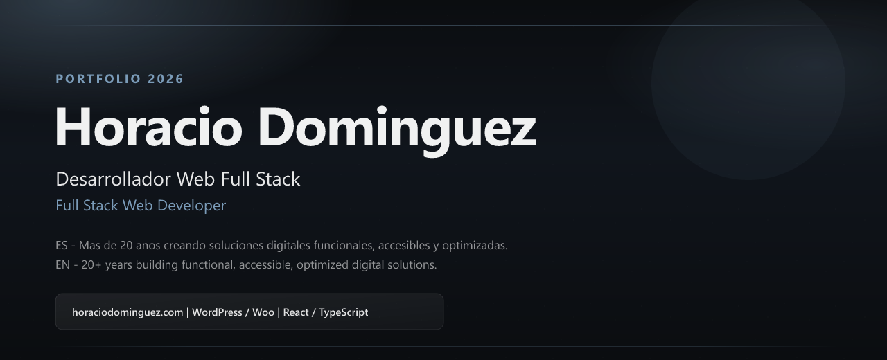
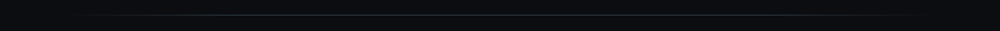
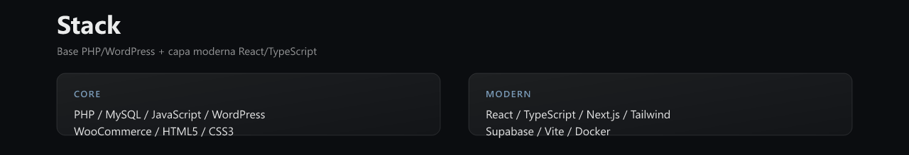
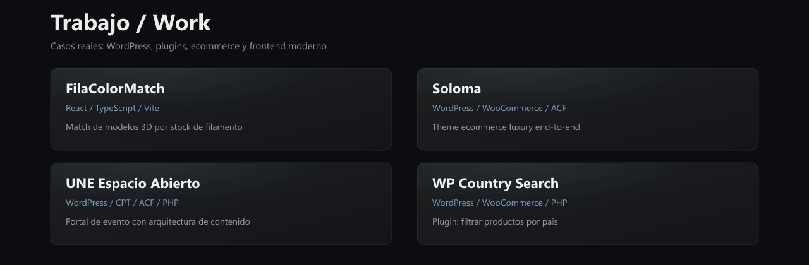
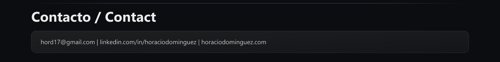

<!-- Profile README - Portfolio 2026 look via PNG (GitHub Camo breaks many SVGs) -->

  

  
  &#160;
  
  &#160;
  

  

  

  

  

  <a href="https://filacolormatch.vercel.app/">FilaColorMatch</a>
  &#160;·&#160;
  <a href="https://soloma.co/">Soloma</a>
  &#160;·&#160;
  <a href="https://uneespacioabierto.com.ar/">UNE</a>
  &#160;·&#160;
  <a href="https://github.com/horaciodominguez/wp-country-search">WP Country Search</a>
  &#160;·&#160;
  <a href="https://horaciodominguez.com">Mas en el portfolio</a>

  

  

 

  
  

